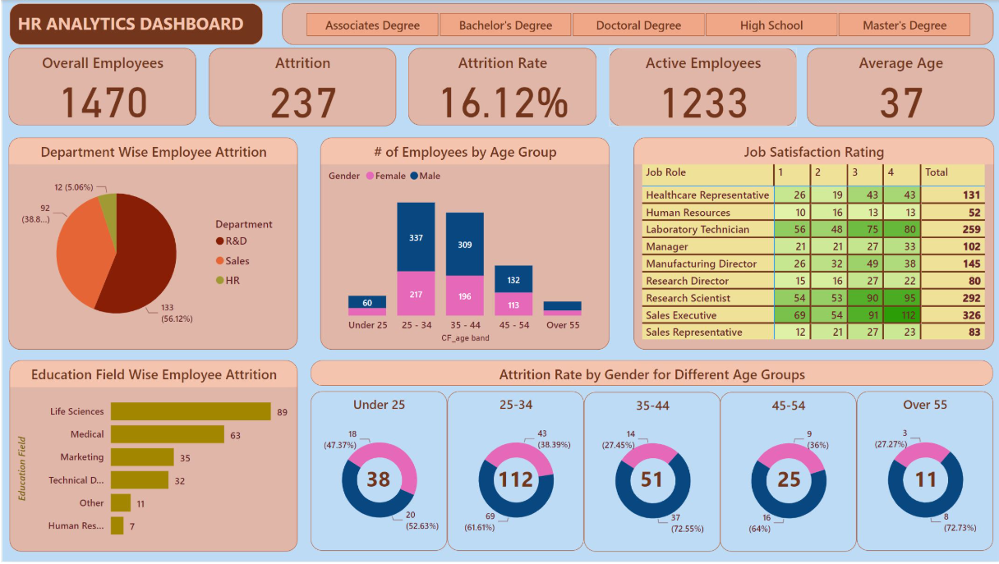
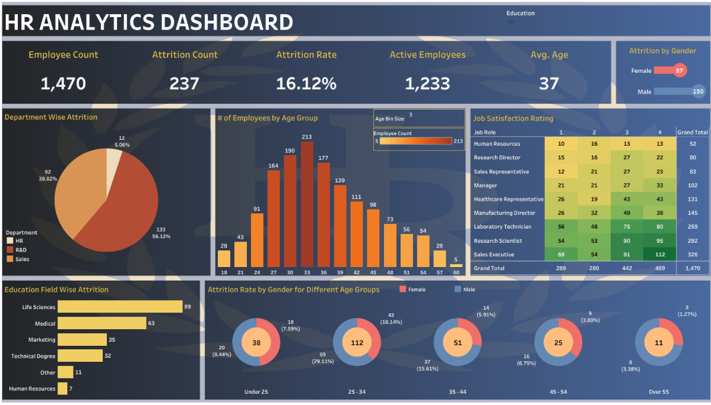

# Employee Analytics Suite (HR-Insights)

## Project Overview

This project aims to address the challenges faced by the HR department of a medical components manufacturing company in analyzing and visualizing key HR metrics. The HR department is responsible for monitoring employee data, but there was a lack of well-defined performance indicators for tracking and analyzing important HR metrics. This project leverages **Power BI**, **Tableau**, **SQL**, and **Excel** to create a set of interactive dashboards and reports, providing insights into the HR data and helping HR professionals make informed decisions.

## Tools Used

- **Power BI**: Used to create dynamic and interactive dashboards for HR analytics.
- **Tableau**: Created custom charts and visualizations to analyze HR data.
- **SQL**: Employed for data extraction, querying, and creating test documents for data validation.
- **Excel**: Designed interactive dashboards with pivot tables and charts to represent key HR metrics.

## Data Source

The dataset used in this project is the HR Data for 2022 from a medical components manufacturing company (open-source data). It contains employee data, including attributes like age, department, job satisfaction, education field, and attrition rates.

## Power BI Dashboard

## Tableau Dashboard

## Problem Statement

The HR department faces a lack of clearly defined performance indicators to systematically track and analyze HR metrics. The main goal of this project is to develop KPIs and visualizations to help the HR department:

- Monitor and assess the total number of employees
- Track employee attrition and turnover rates
- Analyze workforce demographics and job satisfaction levels
- Identify departments with high attrition rates
- Evaluate education field-wise attrition and retention strategies

## KPIs Designed

1. **Employee Count**: Provides insights into the total number of employees.
2. **Attrition Count**: Tracks the number of employees who have left the organization.
3. **Attrition Rate**: Calculates the turnover rate to evaluate employee satisfaction and engagement.
4. **Active Employees**: Differentiates between active and inactive employees.
5. **Average Age**: Helps in understanding workforce demographics for succession planning.

## Visualizations Created

- **Attrition by Gender**: Analyzes attrition trends based on gender.
- **Department-wise Attrition**: Identifies departments with high attrition rates.
- **Number of Employees by Age Group**: Analyzes employee distribution across different age groups.
- **Job Satisfaction Ratings**: Measures employee engagement and satisfaction levels.
- **Education Field-wise Attrition**: Analyzes attrition based on education fields.
- **Attrition Rate by Gender for Different Age Groups**: Displays attrition rates across genders and age groups.

## Testing Documentation

**Test Document for Power BI and Tableau Reports**

| **Test No.** | **Sheet Name**         | **Query**                                                                                                                                                            | **Test Result** | **QA Remark** |
|--------------|------------------------|---------------------------------------------------------------------------------------------------------------------------------------------------------------------|-----------------|---------------|
| 1            | KPI - Employee Count    | `select sum(employee_count) as Employee_Count from hrdata;`                                                                                                         | Pass            | Exact match   |
| 2            | KPI - Attrition Count   | `select count(attrition) from hrdata where attrition='Yes';`                                                                                                       | Pass            | Exact match   |
| 3            | KPI - Attrition Rate    | `select round (((select count(attrition) from hrdata where attrition='Yes') / sum(employee_count)) * 100,2) from hrdata;`                                          | Pass            | Exact match   |
| 4            | KPI - Active Employees  | `select sum(employee_count) - (select count(attrition) from hrdata where attrition='Yes') from hrdata;`                                                             | Pass            | Exact match   |
| 5            | KPI - Average Age       | `select round(avg(age),0) from hrdata;`                                                                                                                             | Pass            | Exact match   |
| 6            | Attrition by Gender     | `select gender, count(attrition) as attrition_count from hrdata where attrition='Yes' group by gender order by count(attrition) desc;`                             | Pass            | Exact match   |
| 7            | Department-wise Attrition| `select department, count(attrition), round((cast(count(attrition) as numeric) / (select count(attrition) from hrdata where attrition='Yes')) * 100, 2) as pct from hrdata where attrition='Yes' group by department order by count(attrition) desc;` | Pass            | Exact match   |
| 8            | No of Employees by Age Group | `select age, sum(employee_count) as employee_count from hrdata group by age order by age;`                                                                          | Pass            | Exact match   |
| 9            | Education Field-wise Attrition | `select education_field, count(attrition) as attrition_count from hrdata where attrition='Yes' group by education_field order by count(attrition) desc;`             | Pass            | Exact match   |
| 10           | Attrition Rate by Gender for Different Age Groups | `select age_band, gender, count(attrition) as attrition, round((cast(count(attrition) as numeric) / (select count(attrition) from hrdata where attrition = 'Yes')) * 100,2) as pct from hrdata where attrition = 'Yes' group by age_band, gender order by age_band desc;` | Pass            | Exact match   |
| 11           | Job Satisfaction Rating | `select * from crosstab('select job_role, job_satisfaction, sum(employee_count) from hrdata group by job_role, job_satisfaction order by job_role, job_satisfaction') as ct(job_role varchar(50), one numeric, two numeric, three numeric, four numeric) order by job_role;` | Pass            | Exact match   |

---

## Conclusion

This project demonstrates the ability to use multiple data analysis tools to provide HR professionals with actionable insights. The developed dashboards and SQL queries offer comprehensive views of employee data, enabling the HR department to track key metrics and improve workforce management.

---
